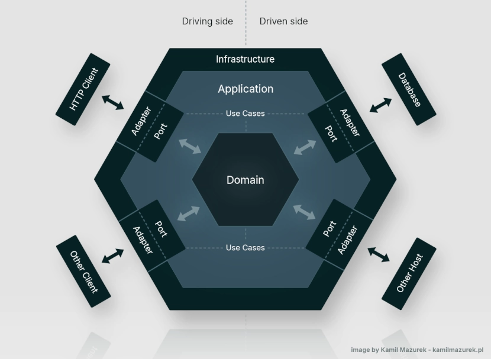

<!-- prettier-ignore-start -->
<!-- eslint-disable -->
# product-comparison-hexagonal - Rochi Santiago


## Descripción

Esta API permite **crear, listar, actualizar y comparar productos** según sus especificaciones técnicas y precio.  
Genera comparaciones detalladas y un resumen balanceado usando estrategias flexibles y extensibles.  

**Stack:** NestJS, TypeScript, TypeORM, SQLite, Swagger.

[📄 Swagger Docs](http://localhost:3000/api)


## Arquitectura y diseño

 El proyecto está diseñado siguiendo arquitectura hexagonal, buscando máximo desacoplamiento, modularidad y testabilidad. Cada módulo está organizado con claridad en dominio, aplicación y adaptadores de infraestructura, asegurando que la lógica de negocio permanezca independiente de la base de datos, controladores o frameworks. Este enfoque facilita cambios de infraestructura futuros, como migrar de un driver orm a json, sin impactar el core de la aplicación.

### Para la gestión de la lógica de negocio, se implementaron los siguientes patrones:

- **Ports & Adapters (Hexagonal):** todos los servicios de aplicación interactúan con la infraestructura a través de puertos definidos en application/ports, y los adaptadores (repositories, mappers) implementan estas interfaces, manteniendo la independencia del dominio.

- **Factory:** ProductFactory se encarga de crear y actualizar entidades a partir de comandos, encapsulando la lógica de inicialización y garantizando la consistencia de los objetos del dominio.

- **Aggregate Root:** asegura la integridad de las entidades relacionadas dentro del dominio, centralizando las operaciones críticas.

- **Mapper:** ProductMapper traduce entre modelos de persistencia y entidades de dominio, aislando la capa de infraestructura y manteniendo el dominio puro.

- **Command / Query (CQRS-Lite):** los commands y queries separan las operaciones de escritura y lectura, aumentando la escalabilidad y permitiendo evolucionar hacia un sistema event-driven en el futuro.

- **Strategy + Registry:** para la comparación de especificaciones, cada estrategia encapsula la lógica específica (ScreenStrategy, MemoryStrategy, etc.), y el Registry centraliza la gestión de estas estrategias, permitiendo agregar nuevas comparaciones sin modificar el flujo existente.

- **Composición / Driver Switch:** el patrón de composición se aplica para decidir dinámicamente la implementación de la base de datos (orm o json), facilitando cambios de infraestructura sin afectar la capa de aplicación.

La combinación de estos patrones permite que el servicio de comparación sea flexible, extensible y altamente testeable, aprovechando la separación de responsabilidades de la arquitectura hexagonal y asegurando que cada pieza del sistema cumpla un rol claro y aislado.


## Estructura principal

```text
src/
├── 🟢 common/                # Utilidades, pipes, guards compartidos
├── 🟢 core/                  # Config global, módulos compartidos
├── 🔵 modules/
│   ├── 🟠 mock/                  # Generación de datos de prueba
│   └── 🔵 product/
│       ├── 🟡 domain/        # Entidades puras, value objects, factories
│       │   ├── entities/
│       │   ├── value-objects/
│       │   └── factories/
│       ├── 🟠 application/           # Casos de uso / servicios de aplicación
│       │   ├── commands/             # Objetos de comando 
│       │   ├── queries/              # Objetos de consulta
│       │   ├── ports/                # Interfaces de entrada y salida que la app implementa o requiere
│       │   └── services/                # Puntos de entrada a la app principal (interfaces)
│       │       └── compare-strategy/        # Estrategias de comparacion y registry
│       ├── 🟣 presenters/             # Adaptadores de entrada (HTTP layer)
│       │   ├── controllers/
│       │   └── dtos/
│       │       └── res/         # DTOs de respuesta
│       ├── 🟤 infrastructure/  # Adaptadores de salida, drivers
│       │   └── persistence/    # Implementaciones de drivers de persistencia, cada uno contiene entidades, mappings, repositorios
│       │       └── typeORM/  
└── main.ts                   # Punto de entrada de la aplicación

```

### Setup & Comandos

```bash
# Instalar dependencias
$ npm install

# Ejecutar la app en desarrollo
$ npm run start

# Modo watch
$ npm run start:dev

# Ejecutar tests
$ npm run test

```

## Endpoints


### 🔵 Product Module

| Endpoint                     | Método | Descripción                        |
|-------------------------------|--------|------------------------------------|
| `/api/products`               | POST   | Crear un producto                  |
| `/api/products`               | GET    | Listar productos (paginación)     |
| `/api/products/:id`           | GET    | Obtener producto por ID            |
| `/api/products/:id`           | PATCH  | Actualizar producto                |
| `/api/products/compare`       | POST   | Comparar dos productos             |

### 🟠 Mock Module

| Endpoint              | Método | Descripción                                 |
|-----------------------|--------|---------------------------------------------|
| `/api/mock/products`  | POST   | Genera y guarda productos de prueba en la base de datos |


## 📐 Arquitectura Hexagonal (Vista simplificada)





<!-- eslint-enable -->
<!-- prettier-ignore-end -->
